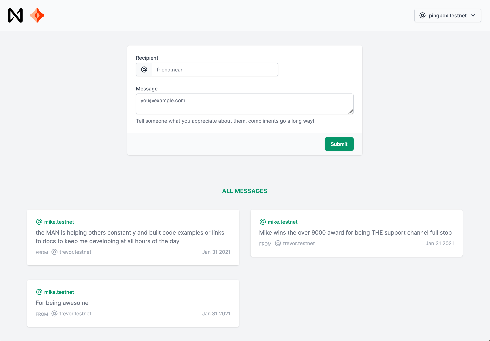

<br />
<br />

<p>

</p>

<p>

</p>

<br />
<br />

# Near Ceramic Vue

A quick start setup for a dApp in NEAR, Ceramic, Vue 3, Tailwind CSS 2

This starter template also includes:

- [Vue-Near](https://www.npmjs.com/package/vue-near) Easy NEAR Blockchain methods using `$near`
- [Vue Router 4.x](https://github.com/vuejs/vue-router-next)
- [Inter var font](https://github.com/rsms/inter) (self hosted, woff2, version 3.15)
- First-party plugins needed for Tailwind UI. Uncomment them in `tailwind.config.js` to enable.
  * [@tailwindcss/forms](https://github.com/tailwindlabs/tailwindcss-forms)
  * [@tailwindcss/typography](https://github.com/tailwindlabs/tailwindcss-typography)
  * [@tailwindcss/aspect-ratio](https://github.com/tailwindlabs/tailwindcss-aspect-ratio)

### Example UI:



----

### Getting Started 🚀

#### Install

npm:
```sh
npm install
```
yarn:
```sh
yarn
```

#### Development

npm:
```sh
npm run dev
npm run build
npm run contract:build
npm run contract:dev:deploy
npm run contract:deploy
npm run contract:test
```
yarn:
```sh
yarn dev
yarn build
yarn contract:build
yarn contract:dev:deploy
yarn contract:deploy
yarn contract:test
```

### Bonus
- [vue-tailwindcss-cdn](https://github.com/web2033/vue-tailwindcss-cdn) (a single HTML file with CDN links)
- [CodePen Template](https://codepen.io/web2033/pen/QWNbwxY) with a similar stack (Vue 3.x + Tailwind 2.x + Inter var font)

## Near Contract

Commands for testing. NOTE: You must change the account id to the contract YOU own. `dev-1612737149816-4004648` is the dev account created during `dev-deploy`, yours will be different. See console output.

```js
// Deploy
near dev-deploy --wasmFile ./contract/res/near_ceramic.wasm

// Create a message
near call dev-1612737149816-4004648 create_message '{"to": "t.testnet","doc_id":"did:..."}' --accountId t.testnet

// get total messages
near view dev-1612737149816-4004648 get_count --accountId t.testnet

// get single message
near view dev-1612737149816-4004648 get_doc_id '{"index":1}' --accountId t.testnet

// get all messages
near view dev-1612737149816-4004648 get_doc_ids --accountId t.testnet
```

## Showcase

Did you use this template? If so, send a PR so it can be showcased here! 🎉

## Tests

I would love help writing tests. ❤️

## License

[MIT](LICENSE.txt) License

----

### Refill My ☕️?

If you feel this helped you in some way, you can tip `tjtc.near`